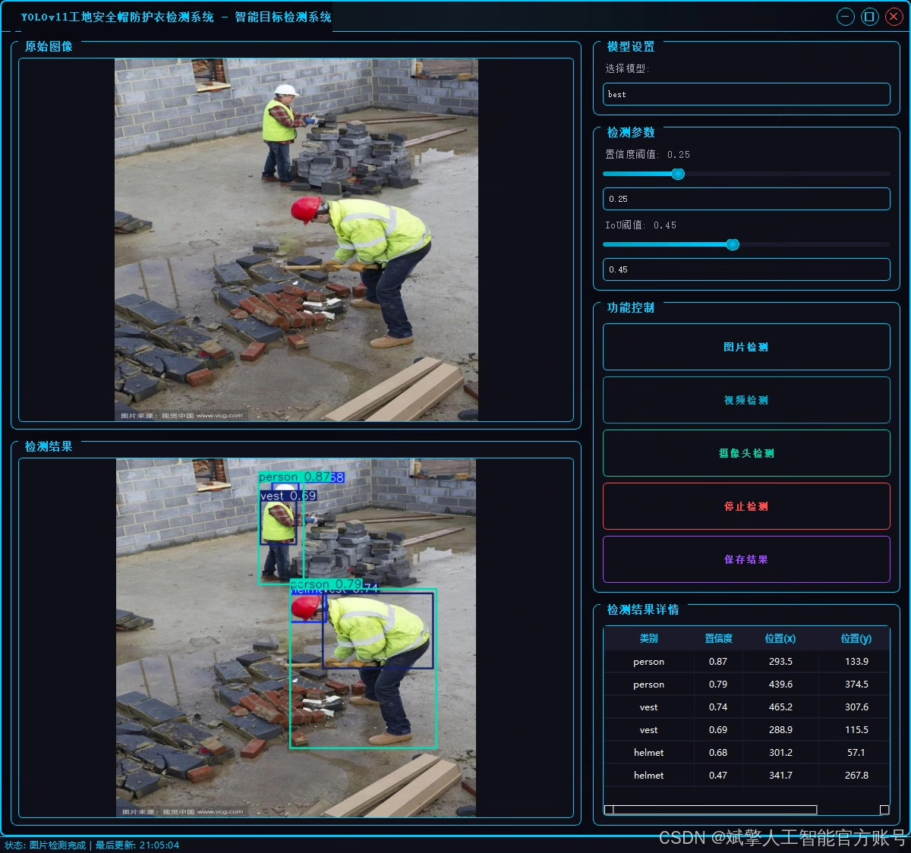
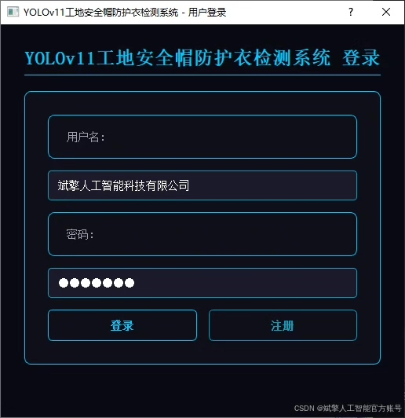
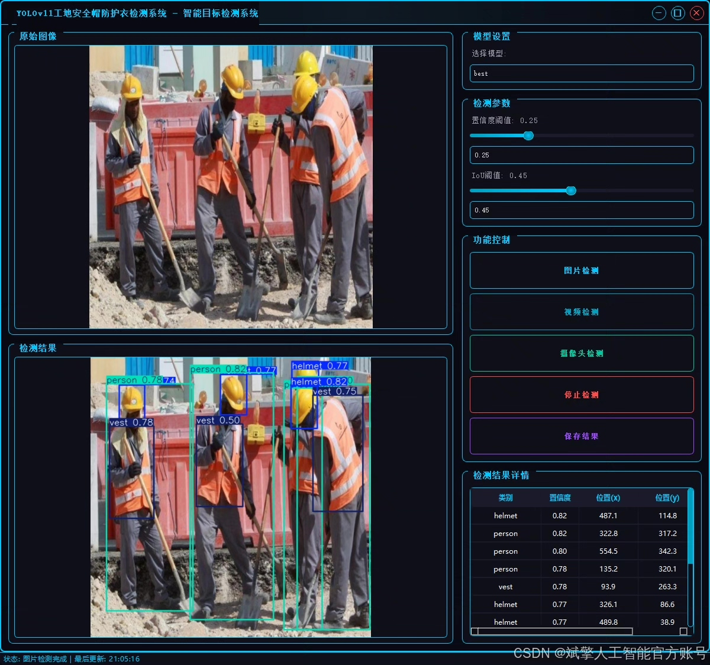
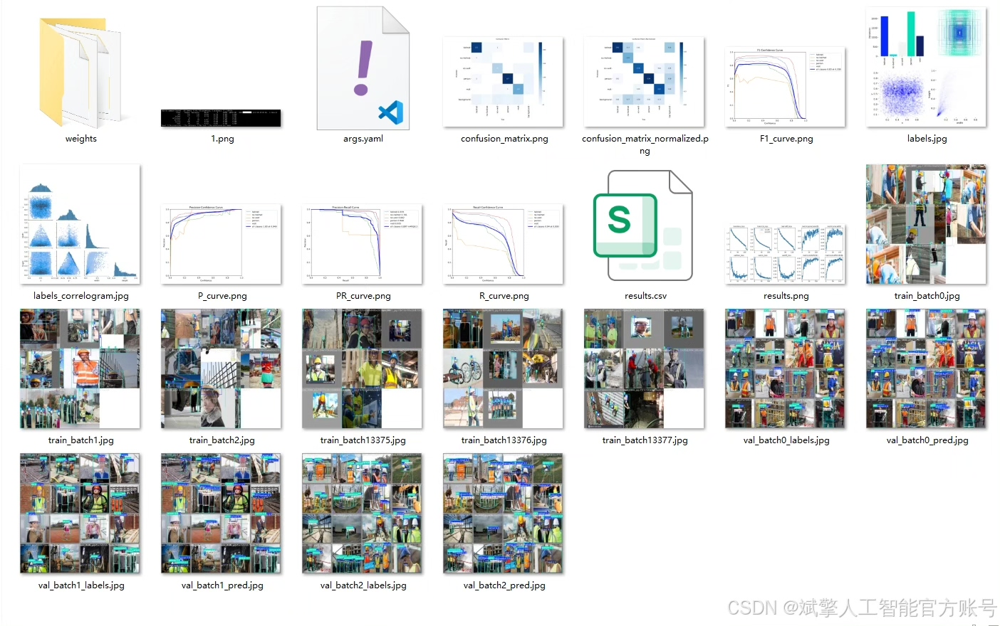
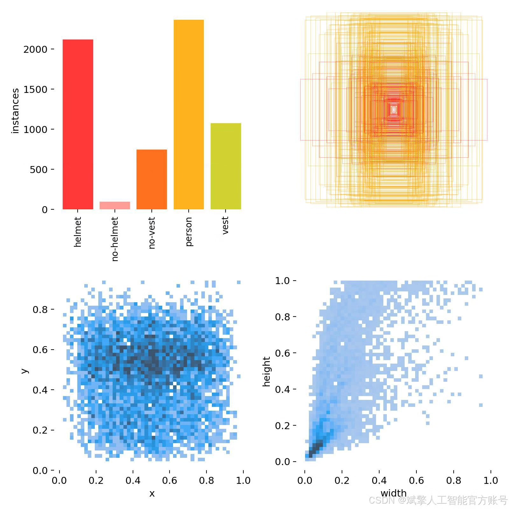
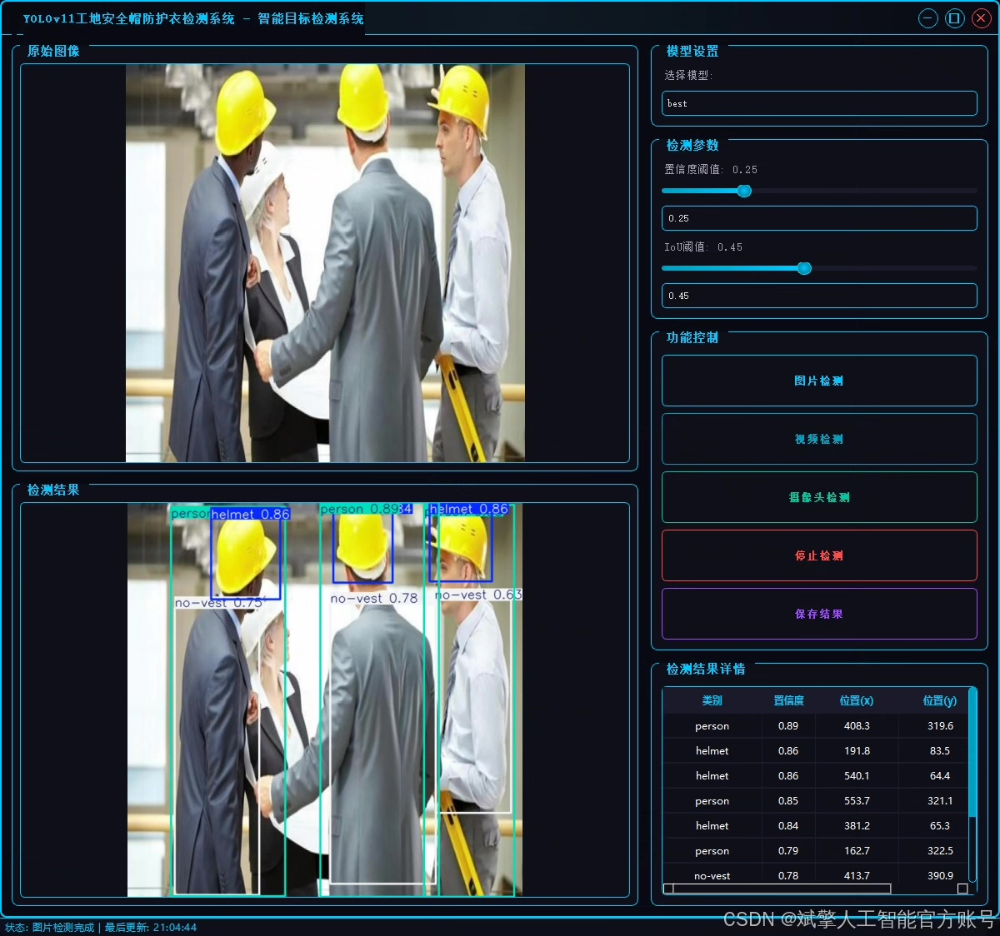
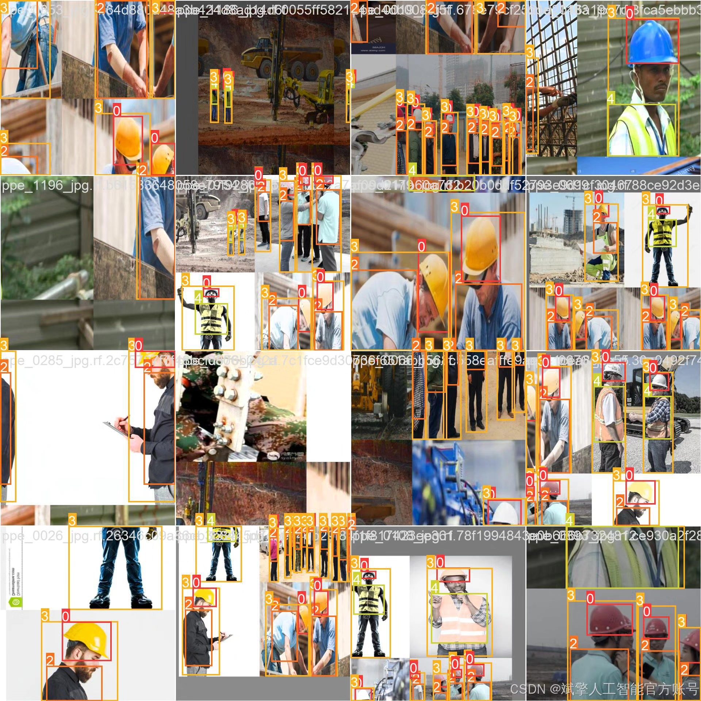
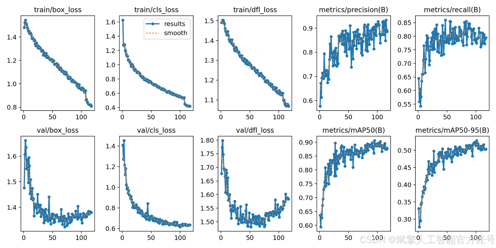
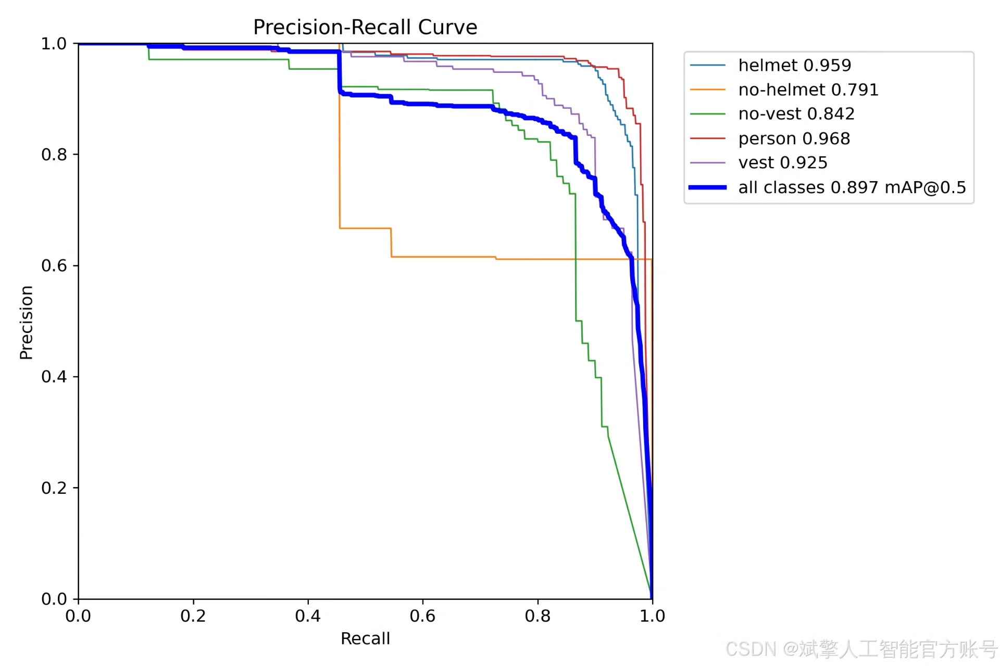

# YOLOv11 construction site safety helmet and protective clothing inspection system

## Body

YOLOv11 Construction Site Safety Helmet and Protective Clothing Identification System Based on Deep Learning YOLOv11

This paper designs and implements a construction site safety helmet and protective clothing identification system based on the deep learning YOLOv11 algorithm, aiming to enhance the efficiency of construction site safety management. The system employs the YOLOv11 model for target detection, supporting real-time recognition of five categories of targets: safety helmet (helmet), no safety helmet (no-helmet), no protective clothing (no-vest), ordinary personnel (person), and protective clothing (vest). The dataset includes a training set of 997 images, a validation set of 119 images, and a test set of 90 images, covering diverse construction site scenarios. The system integrates a user-friendly UI interface and features login registration functionality. Experiments show that the system achieves high detection accuracy and real-time performance on the test set, providing an effective intelligent solution for construction site safety supervision.

Dataset:
nc: 5
names: ['helmet', 'no-helmet', 'no-vest', 'person', 'vest'],
dataset quantity: training set 997 images, validation set 119 images, test set 90 images

✅ User login registration: Supports password verification and security validation.
✅ Three detection modes: Based on the YOLOv11 model, supports image, video, and real-time camera detection, accurately recognizing targets.
✅ Dual-screen comparison: Displays original images and detection results in the same screen.
✅ Data visualization: Real-time table displaying the category, confidence, and coordinates of detected targets.
✅ Intelligent parameter adjustment: Offers a confidence slide bar, dynamically optimizing detection accuracy to meet different scene needs.
✅ Sci-fi style interactive interface: Dark theme combined with dynamic light effects, reducing visual fatigue and improving operational experience.

## Images

## Payment

Here is a pay link on Stripe ( https://buy.stripe.com/3cs8yP7sY87d0vu9AB ). Please contact me lonlonago@foxmail.com after funding $89, and I will send you a complete data files , thank you!

